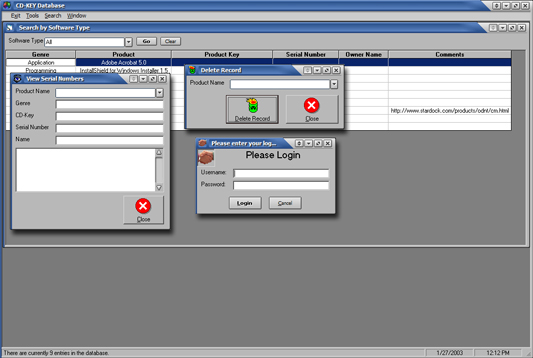



## New CD\-Key Database

### Description

New and improved database application for storing Serial numbers and CD/Product Keys. It uses DAO 3.6 (part of MDAC, downloadable from Microsoft) flex grid, simple encode/decode function for keeping the database "secure." Let me know what you think, I dont care about the votes. Sorry, but I did NOT include ANY actual serial numbers or CD/Product Keys.
 
### More Info
 

             |
---                |---
**Submitted On**   |2003-01-27 12:09:30
**By**             |[VBScript](https://github.com/Planet-Source-Code/PSCIndex/blob/master/ByAuthor/vbscript.md)
**Level**          |Intermediate
**User Rating**    |5.0 (10 globes from 2 users)
**Compatibility**  |VB 6\.0
**Category**       |[Databases/ Data Access/ DAO/ ADO](https://github.com/Planet-Source-Code/PSCIndex/blob/master/ByCategory/databases-data-access-dao-ado__1-6.md)
**World**          |[Visual Basic](https://github.com/Planet-Source-Code/PSCIndex/blob/master/ByWorld/visual-basic.md)
**Archive File**   |[New\_CD\-Key1535261272003\.zip](https://github.com/Planet-Source-Code/vbscript-new-cd-key-database__1-42739/archive/master.zip)

